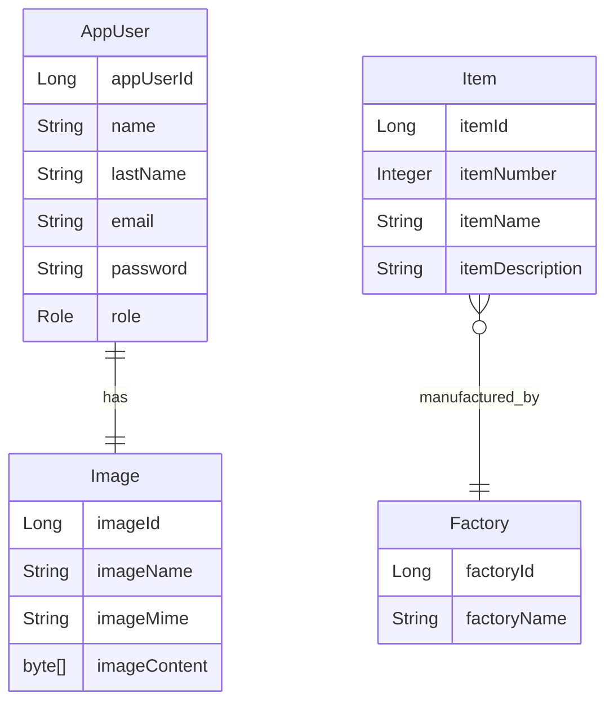

# 🔌 Electricity Store

An inventory and user management system for an electrical supply store. Built with a layered architecture using Spring Boot, this backend-focused web application demonstrates secure authentication, role-based access control, CRUD operations, and robust form validations. Developed as part of a learning project to strengthen backend development skills with modern Java tools and practices. **This project is inspired by the learning resources and courses provided by [Egg Live](https://www.linkedin.com/company/egglive/).**

---

## 🧱 Tech Stack

* **Language:** Java 17
* **Framework:** Spring Boot 3.x
* **Template Engine:** Thymeleaf
* **Database:** MySQL
* **Security:** Spring Security
* **Build Tool:** Maven
* **ORM:** Spring Data JPA + Hibernate
* **Lombok:** For boilerplate code reduction
* **Frontend:** Bootstrap 5 (minimal, just for forms and styling)

---

## 🚀 Key Features

### 🔑 Authentication & Authorization

* Spring Security-based login/logout
* Role-based access control (USER, ADMIN)
* Session context update on profile change

### 👤 User Management

* View and edit own profile (users)
* View, edit, and delete all users (admins)
* Assign and modify user roles
* Upload user profile images

### ⚖️ Article Management (Stock)

* Admins can create, update, and delete articles
* View catalog with article details

### 🔒 Input Validation & Error Handling

* Backend validations with descriptive messages
* Custom error controller with friendly error pages
* Regex validation for passwords (strong password policy)

---

## 💡 Project Architecture

### MVC + Layered Architecture

```
com.egg.biblioteca
├── controllers     # Controllers (Portal, Admin, Error)
├── entities        # JPA Entities (User, Article, Image)
├── repositories    # Spring Data Repositories
├── services        # Business logic and validations
├── configuration   # Spring Security Configuration
├── exceptions      # Custom exceptions
├── initializers    # Startup logic (AdminUserInitializer, DefaultImageInitializer)
```

### Separation of Concerns

* Controllers handle web routes and responses
* Services manage logic, validation, and database interaction
* Repositories abstract database access
* Entity classes use Lombok annotations to reduce boilerplate
* Initializers run on startup to ensure default admin user and fallback image

---

## 🛠️ Notable Implementation Details

* Custom `MyException` for controlled error flow
* Automatic session refresh on user profile update
* Admin dashboard with dynamic user list and actions
* Thymeleaf `fragments` for modular views (header, footer, head)
* Consistent UI layout across all views
* Form error messages injected via `RedirectAttributes`
* AdminUserInitializer: ensures an admin user exists on startup
* DefaultImageInitializer: sets a default profile image if not present

---

## 🚫 Security Highlights

* Routes protected with `@PreAuthorize` annotations
* Strong password policy: min 8 chars, upper/lowercase, number, special char
* Safe image uploads (stored in DB as byte arrays)
* Logged-in user data refreshed when profile is updated

---

## 🔄 Future Improvements

* REST API endpoints for integration
* Pagination for user and article lists
* Audit logging for changes
* Enhanced error tracking with custom exception handler

---

## 📍 Project Status

> ✅ Fully functional backend with Thymeleaf views. Designed primarily as a **backend learning project**, but built with clean code, maintainability, and expansion in mind.

---

## 📲 Demo

> Coming soon: A short video walkthrough of the system from login to user/article management.

---

## 🚀 How to Run Locally

1. Clone the repository:

```bash
git clone https://github.com/MarioAndresR/electricity-store.git
```

2. Configure MySQL database (schema name `electricity_store`)
3. Update `application.properties` with your DB credentials
4. Build and run the application:

```bash
mvn spring-boot:run
```

5. Visit `http://localhost:8080` in your browser

---

## 📊 Entity Relationship Diagram



---

## 💼 About me

Java Backend Developer | Passionate about clean code, security, and real-world solutions

---

## 🔗 Connect with Me

* [LinkedIn](https://www.linkedin.com/in/marandresro)
* [GitHub](https://github.com/MarioAndresR)

---

> ⭐ If you liked this project or found it useful, feel free to star the repo or reach out!
